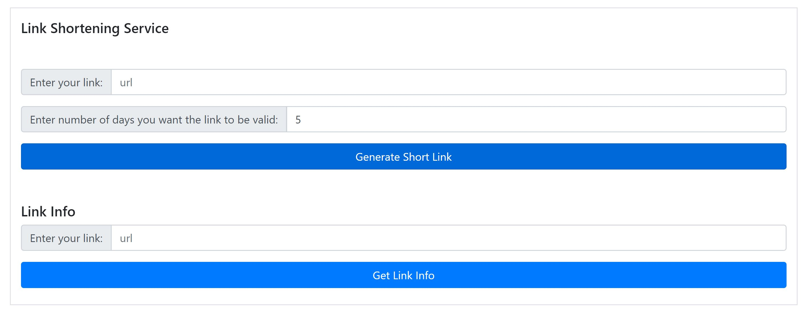
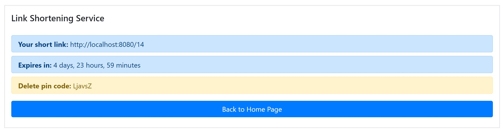
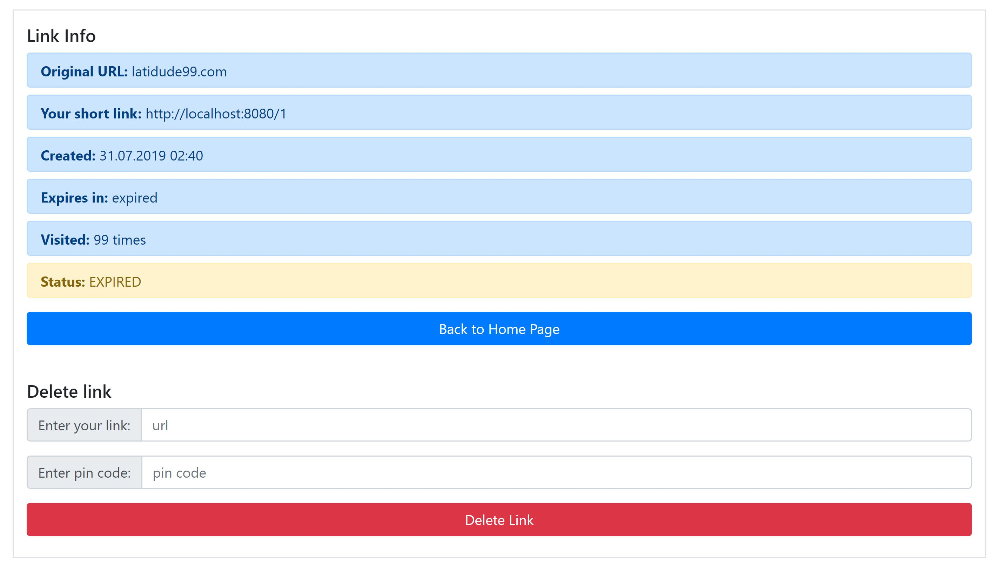
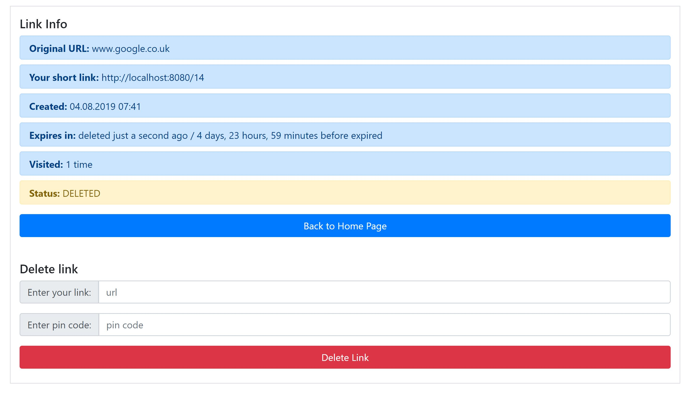

# Link Cutter 

Link shortening service  
  
# General Info

Creates a short link that redirect to the original URL address. Allows to specify number of days the link will remain valid. Also, gives an option to delete the link with a pin code generated at the same time as the link was.   

Info page displays:
- the original URL address
- the short link
- number of times the link was used
- status of the link: ACTIVE/EXPIRED/DELETED
- time when the link expired/ was deleted

# Screenshots

  

   

  

   

	 

   

	

    
 

	

# Status

Development

# Technologies
- Spring Boot 2.1.6
- Java JDK 8
- Maven 3.60
- H2 1.4.193
- Thymeleaf 3.0.11
- IntelliJ IDEA

**Plugins and libraries**

# License
Link Cutter is free software: you can redistribute it and/or modify it under the terms of the GNU General Public License 
as published by the Free Software Foundation, either version 3 of the License, or (at your option) any later version.
Link Cutter is distributed in the hope that it will be useful, but WITHOUT ANY WARRANTY; without even the implied 
warranty of  MERCHANTABILITY or FITNESS FOR A PARTICULAR PURPOSE.  See the GNU General Public License for more details.
You should have received a copy of the GNU General Public License along with Link Cutter. 
If not, see http://www.gnu.org/licenses/ or write to: latidude99@gmail.com

# Contact
You can email me at latidude99@gmail.com
